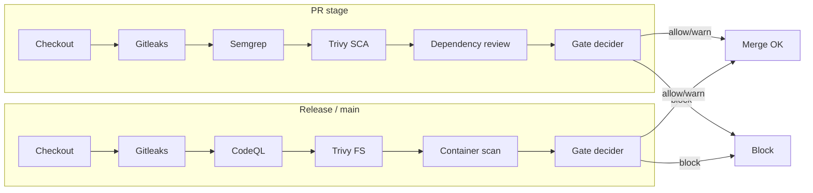

# Pipeline diagram (Mermaid)

Export this to PNG/SVG for the article (e.g. Mermaid Live Editor or `mmdc -i pipeline_diagram.md -o pipeline_diagram.png`).

## Gates placement

| Stage   | Gates |
|---------|--------|
| PR      | Secrets (block), SAST in changed (warn/block), SCA (warn), Dependency review (warn/block) |
| Release | Secrets (block), CodeQL high/critical (block), SCA runtime+fix (block), Container (block) |
